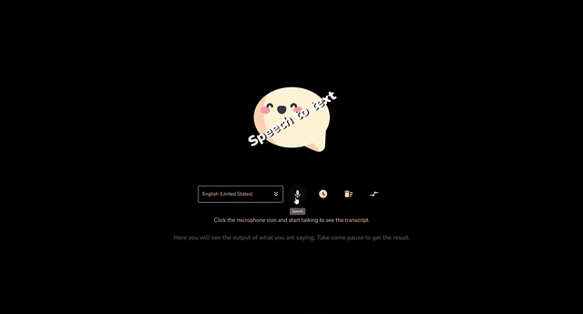

# Speech recognition 🗣💬

> Speech recognition and synthesis using the Web speech API 💭

### See the <a href='https://dnt-knw.github.io/Speech-recognition' target='_blank' title='Click to open the project'>Demo</a> 👁

In order to use this app, __allow your browser to use your microphone__ 🎙️🔊

## The "Speech to text" block ⬛

### Usage ⌨️

#### 📝 The "Select" element

📜 Offers 36 different languages for converting speech to text

#### 📝 The "Speech" button

📜 If enabled, it listens your speech and converting it to text

#### 📝 The "Interim results" button

📜 If enabled, the transcript will be shown as soon as it is converted, otherwise you will see the transcript when you finish speaking

#### 📝 The "Reset" button

📜 Cleans the transcript in the input

#### 📝 The "Text to speech" button

📜 Opens the "Text to speech" block

## The "Text to speech" block ⬛

### Usage ⌨️

#### 📝 The "Select" element

📜 Offers different voices for speech synthesis

#### 📝 The "Listen" button

📜 Converts text written in the input into speech

#### 📝 The "Cancel" button

📜 Cancels the robot's speech

#### 📝 The "Speech to text" button

📜 Opens the "Speech to text" block

#### 📝 The "Rate" and "Pitch" sliders

📜 Regulate the rate and pitch on the voice

## ❗️ Browser support ❗️

### I have tested my app in different browsers and below is the __browser support__

#### Speech recognition 💬

| Microsoft Edge | Google Chrome | Yandex browser | Mozilla Firefox  | Opera | Safari |
|------|------|------|------|------|------|
| Full support | Full support | Partial support | No support | No support | Full support |

⛔ The "Interim results" feature does not work correctly in the "Yandex" browser

⛔ The "Mozilla Firefox" and "Opera" browsers does not support these features at all

✅ Tested on the __latest versions__ of browsers

#### Speech synthesis 🗣

| Microsoft Edge | Google Chrome | Yandex browser | Mozilla Firefox  | Opera | Safari |
|------|------|------|------|------|------|
| Partial support | Full support | Full support | No support | No support | Full support |

⛔ The "Rate" and "Pitch" features work correctly, but not with all voices in the "Microsoft Edge" browser

⛔ The "Mozilla Firefox" and "Opera" browsers does not support these features at all

✅ Tested on the __latest versions__ of browsers
